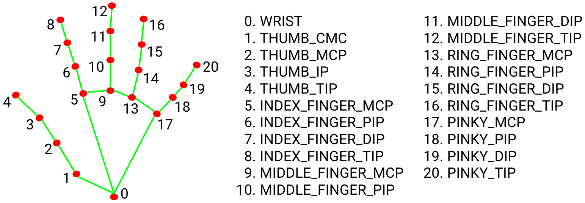
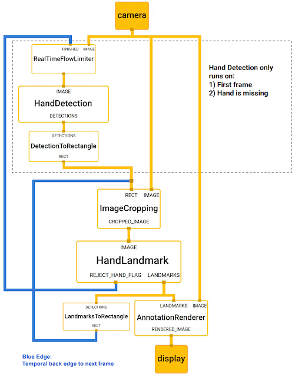

# Hand Volume Control


## Возможности

- Детекция ладони.
- Определение 21 ключевой точки руки.



- Отслеживание положения руки между кадрами.
- Управление громкостью на основе расстояние между большим и указательным пальцами.
- Визуализация текущего уровня громкости.
- Работа в режиме реального времени.

Для определения ключевых точек используется 2-х этапный пайплайн, включающий модель детектора ладони и модель регрессора ключевых точек руки. Ключевые точки в одном кадре, используются для локализации области регрессора в последующих кадрах. Детекция ладони выполняется только на первом кадре или в случае потери руки из вида. 

Принцип работы аналогичен [решению Mediapipe](https://developers.google.com/edge/mediapipe/solutions/vision/hand_landmarker). Cхематичное описание пайплайна представлено ниже.




## Запуск

```bash
git clone https://github.com/spolyachenko/HandVolumeControl
cd HandVolumeControl/build/Release
.\HandVolumeControl.exe
```
### Управление

- Покажите руку перед камерой.
- Для изменения громкости изменяйте расстояние между большим и указательным пальцами.
- Текущее значение громкости отображается на экране в виде горизонтальной шкалы.

## Сборка

Успешная сборка производилась в следующей конфигурации:
- CMake 3.29.0
- MSVC 2022 19.44.35228
- vcpkg
    - OpenCV 4.12.0
    - ONNXRuntime 1.23.2
- CUDA v12.8.61
- CUDnn v9.23

```bash
cmake -DCMAKE_BUILD_TYPE=Release -B build -G "Visual Studio 17 2022"
cmake --build build --config Release --target HandVolumeControl 
```